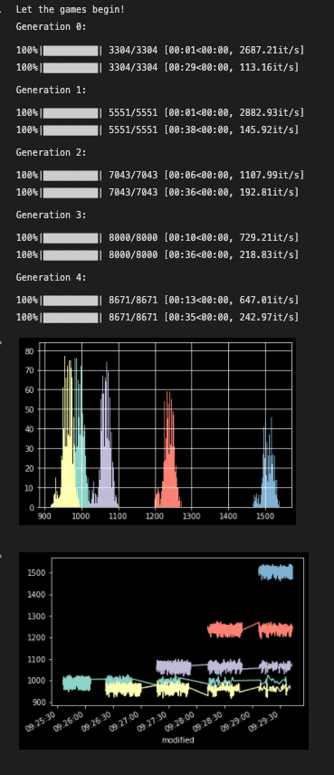

# A python library for playing the Okaymon Gamified Drop without spending thousands of dollars
    
## To tweak 
  
1. navigate to `main.py`
2. input an n-tuple of integers whose product = 2000
```
# distribution
Game((20,100)).play()
```
  
## To run
  
```bash
python3 -m pip install -r requirements.txt
python3 main.py
```
  
  
## Output
  
It'll take about 6 minutes to run a whole drop simulation, then you'll see some graphs I guess 

### Score disctribution by gen 
  

  
  
